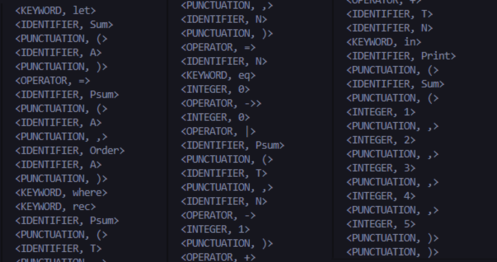
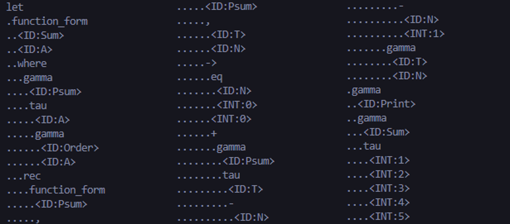
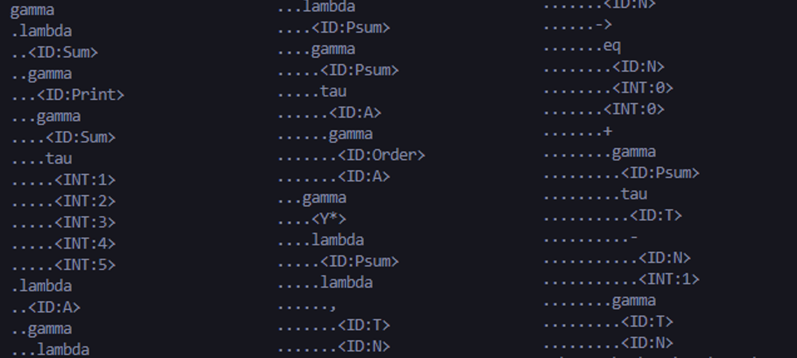
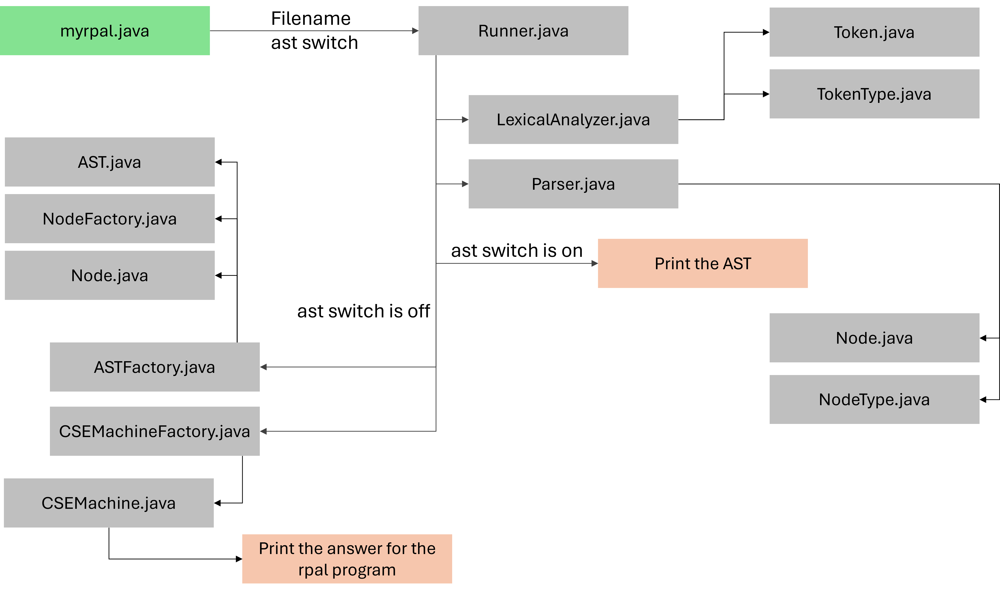

# RPAL Interpreter

An interpreter for RPAL (Recursive Programming Algoritmic Language). The language presents a simplified yet expressive syntax for implementing recursive algorithms and functional constructs.
Through parsing the RPAL code, constructing the Abstract Syntax Tree, standardizing it for consistent interpretation and executing it using a CSE machine, the interpreter will recognize RPAL program, execute it and the answer will be returned as output

## Components

1. [Lexical Analyzer](#lexical-analyzer)
2. [Parser](#parser)
3. [Standardizer](#standardizer)
4. [CSE Machine](#cse-machine)

Consider the below code as an example RPAL code

let Sum(A) = Psum (A,Order A )

where rec Psum (T,N) = N eq 0 -> 0

| Psum(T,N-1)+T N

in Print ( Sum (1,2,3,4,5) )

## Lexical Analyzer

Responsible for scanning the input RPAL code and converting it into a stream of tokens.
For the example code, the output of the lexical analyzer is as below

## Parser

Responisble for parsing the stream of tokens brought by from the Lexer. The tokens are then checked for syntax errors, and if none found an Abstract Syntax Tree is formed
For the example code, the output of the parser is as below

## Standardizer

Standadizer is responsible for transforming the AST generated by the parser into a standardied form that ensures consisten interpretation of teh program.
For the example code, the output of the standardizer is as below

## CSE Machine

The final component of the interpreter and is responsible for executing the ST generated by the standardizer
For the example code, the outout of the CSE machine will be 15
---
Work flow of the system

